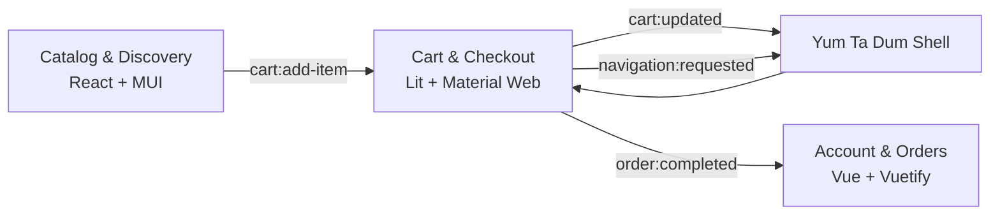

<div align="center">

# 🍲 Yum Ta Dum — Cart & Checkout

### Lit Microfrontend · Group 13 · Component-Based Software Engineering

**Good food. Good mood. Yum Ta Dum.**

`<yum-cart-checkout>`


**Owner:** Nour Al-Huda  
**Responsibility:** Cart & Checkout Microfrontend  
**Architecture:** Frontend-only Microfrontends · Web Components + Custom Events

</div>

---

## ✨ What this repository owns

This repository contains one independently deployable Yum Ta Dum feature component: **Cart & Checkout**.

It is responsible for:

- cart state and quantity management
- one-restaurant-per-cart enforcement
- remove + Undo
- local cart persistence
- delivery address and delivery timing
- Cash / Mock Card / Demo Wallet payment simulation
- final order review
- successful order handoff
- order confirmation for the current session

It intentionally does **not** implement the global header, Yum Ta Dum logo placement, navigation, footer, global notifications, Catalog, authentication, or persistent order history. Those belong to the Shell and the other Microfrontends.

> The goal is not to build another SPA monolith. The goal is to provide one self-contained component with a stable public contract.

---

## 🧩 Microfrontend architecture



The production component is:

```html
<yum-cart-checkout></yum-cart-checkout>
```

The component uses Lit's normal **open Shadow DOM** and does not import another Microfrontend's private source or state.

---

## 🛠 Tech stack

| Area | Technology |
|---|---|
| Component framework | Lit |
| Language | TypeScript |
| UI primitives | `@material/web` |
| Build tooling | Vite |
| Tests | Vitest |
| Integration | Web Components + DOM Custom Events |
| Persistence | Browser `localStorage` |
| Deployment target | Vercel static deployment |

No backend, database, Firebase, Supabase, Redux, Zustand, real authentication provider, or real payment gateway is used.

---

## 🚀 Run locally

```bash
npm install
npm run dev
```

Open the local URL printed by Vite, normally:

```text
http://localhost:5173/
```

The standalone development host lets the component run without the real team Shell and includes development-only controls for simulating Catalog events.

### Useful routes

| Route | Purpose |
|---|---|
| `/cart` | Cart and order summary |
| `/checkout/delivery` | Address + delivery timing |
| `/checkout/payment` | Payment + final review |
| `/order-confirmation` | Current-session confirmation |

There is intentionally no `/checkout/shipping` and no separate review route.

---

## 🧪 Integration demo

`mfe-demo.html` is the small integration harness used to prove that the production custom element can work independently of Catalog and the Shell.

After creating both production outputs:

```bash
npm run build
npm run build:mfe
npm run preview
```

open:

```text
http://localhost:4173/mfe-demo.html
```

The demo should:

1. load `/mfe/yum-cart-checkout.js`
2. render `<yum-cart-checkout>`
3. dispatch realistic `cart:add-item` events from controls outside the component
4. demonstrate a same-restaurant add
5. demonstrate a second-restaurant conflict
6. prove that the Microfrontend reacts only through its public contract

Also open this URL directly:

```text
http://localhost:4173/mfe/yum-cart-checkout.js
```

It must return **JavaScript**, not `index.html`.

---

## 📦 Production MFE bundle

Build the standalone application first, then the library bundle:

```bash
npm run build
npm run build:mfe
```

Expected output:

```text
dist/
├── index.html
├── ...standalone assets...
├── mfe-demo.html
└── mfe/
    ├── yum-cart-checkout.js
    └── yum-cart-checkout.js.map
```

The stable public entry is:

```text
/mfe/yum-cart-checkout.js
```

The filename is intentionally predictable and unhashed so the future Shell can load it safely.

---

## 🔌 Shell integration

```html
<script
  type="module"
  src="https://YOUR-DEPLOYMENT.vercel.app/mfe/yum-cart-checkout.js">
</script>

<yum-cart-checkout></yum-cart-checkout>
```

The Shell should not copy this repository's `src/` directory. It should consume the deployed ES-module bundle and communicate through the documented events.

Full integration examples are in [`docs/integration.md`](docs/integration.md).

---

## 📡 Public event contract

All public Custom Events use:

```ts
{
  bubbles: true,
  composed: true,
}
```

### Consumed

| Event | Direction | Purpose |
|---|---|---|
| `cart:add-item` | Catalog → Cart | Add a `MealItem` |

### Produced

| Event | Direction | Purpose |
|---|---|---|
| `cart:updated` | Cart → Shell | Synchronize cart badge/totals |
| `order:completed` | Cart → Account & Orders | Hand off successful order |
| `navigation:requested` | Cart → Shell | Request global navigation |

### `cart:add-item`

```ts
window.dispatchEvent(new CustomEvent('cart:add-item', {
  detail: {
    item: {
      id: 'meal-101',
      restaurantId: 'rest-01',
      restaurantName: 'Burger House',
      name: 'Classic Cheeseburger',
      description: 'Beef patty, cheddar, lettuce, tomato, pickles, and house sauce.',
      price: 35,
      image: 'https://example.com/burger.jpg',
      category: 'Burgers',
      quantity: 1,
    },
  },
  bubbles: true,
  composed: true,
}));
```

### `cart:updated`

```ts
{
  itemCount: 3,
  subtotal: 94,
  discount: 0,
  deliveryFee: 10,
  total: 104,
  restaurantId: 'rest-01',
  currency: 'ILS'
}
```

`itemCount` is the **sum of quantities**, not the number of cart rows.

### `navigation:requested`

```ts
{ route: '/checkout/delivery' }
```

### `order:completed`

The payload is:

```ts
{
  order: CompletedOrder
}
```

Exact interfaces are documented in [`docs/contracts.md`](docs/contracts.md).

---

## 🛒 Cart rules

- Quantity range: **1–10**
- Adding the same meal increments quantity up to 10
- Maximum quantity message: **“You've reached the maximum quantity (10).”**
- One restaurant per cart
- A second restaurant opens **“One order, one kitchen”** confirmation
- **Keep current cart** keeps everything unchanged
- **Clear and add** replaces the cart only after confirmation
- Remove is a distinct action
- Undo restores the removed meal, quantity, and logical position
- Undo snackbar remains visible for approximately 6 seconds

### Delivery pricing

| Subtotal | Delivery |
|---|---:|
| `< ₪100` | `₪10` |
| `>= ₪100` | **Free** |

Discount is `0`. Coupons and promo codes are outside version 1.

---

## 🛵 Free Delivery Journey

The cart does more than show a plain progress bar.

A small delivery journey communicates progress toward the `₪100` threshold:

- before threshold → **“₪X away from free delivery”**
- threshold reached → **“Free delivery unlocked!”**

Motion is subtle and respects `prefers-reduced-motion`.

---

## 📍 Delivery

Guest checkout requires:

- Full Name
- Phone
- City
- Street Address

Optional fields:

- Area
- Building
- Postal Code

The public contract field is exactly:

```ts
streetAddress
```

Delivery methods:

### ASAP

UI estimate:

```text
25–35 minutes
```

Completed order:

```ts
estimatedDeliveryMinutes: 30
```

### Schedule for later

- must be a valid future date/time
- past time slots are not offered for today
- completed order uses `estimatedDeliveryMinutes: null`

---

## 💳 Payment sandbox

All payment methods are **simulations**. No real charge is made.

| Method | Behavior |
|---|---|
| Cash on Delivery | deterministic simulated success |
| Mock Credit Card | validation + deterministic card result |
| Yum Wallet — Demo | balance check against `₪75.00` |

### Test cards

✅ Success

```text
4242 4242 4242 4242
```

❌ Decline

```text
4000 0000 0000 0002
```

Card requirements:

- Cardholder Name required
- 16-digit card number
- valid future `MM/YY`
- 3-digit CVV

No random payment behavior is used.

A declined payment does **not** clear the cart.

---

## 🔐 Security boundaries

Full card number and CVV exist only in transient component state.

They are never written to:

- `localStorage`
- `sessionStorage`
- URLs or query strings
- console logs
- `CompletedOrder`
- public event payloads

Only the payment method identifier is included in the completed order.

---

## 💾 Persistence

Cart storage key:

```text
yum-ta-dum-cart
```

Only cart data is persisted.

If storage is unavailable, malformed, or quota-limited, the component continues in memory and displays:

> We couldn't save your cart just now — it's still safe in this session.

This Microfrontend does **not** write:

```text
yum-ta-dum-orders
```

Order-history persistence belongs to Account & Orders.

---

## ✅ Successful order handoff

The success sequence is intentionally ordered:

1. create a valid `CompletedOrder`
2. dispatch `order:completed`
3. clear the in-memory cart
4. persist the empty cart
5. dispatch an empty `cart:updated`
6. clear transient card state
7. request `/order-confirmation`

This keeps Cart & Checkout independent from Account & Orders while preserving the shared contract.

---

## ♿ Accessibility

Accessibility is implemented in the UI, not only documented.

Highlights include:

- semantic headings
- visible labels
- native radio semantics
- keyboard-operable controls
- logical tab order
- `aria-invalid` + `aria-describedby`
- accessible Material dialog behavior
- visible `:focus-visible` treatment
- `aria-live` feedback
- icon-only button labels
- 44px mobile touch targets
- selected states communicated by more than color
- reduced-motion support

The approved orange CTA token remains `#F57C00`, but normal CTA text uses `#1F1F1F` rather than inaccessible white text.

---

## 📱 Responsive behavior

| Range | Behavior |
|---|---|
| `<600px` | mobile · single column · 16px padding · sticky checkout bar |
| `600–959px` | tablet · flexible/single-column checkout |
| `>=960px` | desktop · centered layout · sticky ~360px order summary |

The component avoids horizontal page scrolling on mobile.

---

## 🍲 Yumy status illustrations

Yumy is used contextually for friendly product states rather than as a duplicate global logo.

Examples in this MFE include:

- empty cart
- restaurant conflict
- successful order confirmation
- no completed order in the current session

The final Shell owns the global Yum Ta Dum logo and global application chrome.

---

## 🎨 Branding and favicon

The production Microfrontend does not control the browser tab or document `<head>` when it is embedded in the team Shell. The **Shell owns the final global favicon and brand placement**.

For this repository's standalone/demo pages, a matching Yum Ta Dum favicon can still be used for an independent development/deployment experience. Recommended files:

```text
public/favicon.png            # 512×512 transparent PNG
public/apple-touch-icon.png   # 180×180 PNG
```

Then reference them from the standalone HTML host:

```html
<link rel="icon" type="image/png" href="/favicon.png" />
<link rel="apple-touch-icon" href="/apple-touch-icon.png" />
```

Use the same approved simplified Yumy brand icon that the team agrees to use in the Shell. Do not render the global Yum Ta Dum logo inside `<yum-cart-checkout>`.

---

## 🧪 Tests

Run once:

```bash
npm test
```

Watch mode:

```bash
npm run test:watch
```

Coverage focuses on behavior that matters to the public contract:

- cart add/increment/cap/remove/Undo
- one-restaurant rule
- subtotal and delivery calculations
- persistence and storage fallback
- event payloads and event flags
- delivery validation
- scheduled future-time validation
- deterministic card behavior
- wallet balance behavior
- duplicate-submit protection
- CompletedOrder construction
- successful event ordering
- empty cart update after success
- card/CVV persistence security

---

## 🧰 Quality gate

Before pushing or deploying, run:

```bash
npm install
npm run typecheck
npm test
npm run build
npm run build:mfe
```

If all commands pass, preview the production files:

```bash
npm run preview
```

Then manually verify `/mfe-demo.html` and `/mfe/yum-cart-checkout.js`.

---

## 🌐 Vercel

The project is prepared for static Vercel deployment.

Direct application URLs must work:

```text
/cart
/checkout/delivery
/checkout/payment
/order-confirmation
```

The MFE asset must remain a JavaScript response:

```text
/mfe/yum-cart-checkout.js
```

### Deployment URLs

Standalone application:

```text
https://YOUR-DEPLOYMENT.vercel.app/
```

Microfrontend bundle:

```text
https://YOUR-DEPLOYMENT.vercel.app/mfe/yum-cart-checkout.js
```

Replace these placeholders only after deployment has actually been verified.

---

## 🗂 Suggested project structure

```text
src/
├── assets/
├── components/
├── contracts/
├── events/
├── fixtures/
├── order/
├── payment/
├── state/
├── storage/
├── styles/
├── utils/
├── validation/
├── yum-cart-checkout.ts
├── mfe.ts
└── main.ts

docs/
├── contracts.md
└── integration.md
```

---

## 📚 Documentation

- [`docs/contracts.md`](docs/contracts.md) — exact shared TypeScript and event contracts
- [`docs/integration.md`](docs/integration.md) — Shell loading and event-integration examples

---

## ⚠️ Known limitations

This is intentionally a university frontend simulation.

Not included:

- backend/API
- real database
- real authentication
- real payment gateway
- real wallet
- geocoding/maps
- live courier tracking
- inventory reservation
- production fraud/security systems

Account & Orders owns durable order history. This component keeps only the current successful confirmation in memory.

---

## 🧭 Repository boundaries

Do not add the global Yum Ta Dum header, footer, navigation, or duplicated brand logo here.

Do not import another member's implementation source.

Public routes, element names, data contracts, event names, and event payloads are team-level integration contracts and should only change through coordinated agreement.

---

<div align="center">

### Group 13 · Yum Ta Dum

**Cart & Checkout — Nour Al-Huda**

Built as an independently deployable Lit Web Component for Component-Based Software Engineering.

🍔 → 🛒 → 📍 → 💳 → ✅

**Good food. Good mood. Yum Ta Dum.**

</div>
